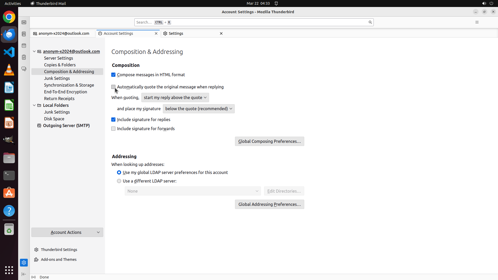

# When I reply to an email, it quotes the original message but offsets it with an indentation and ">" …

[← Thunderbird](../README.md) · [← Showcase](../../README.md)

## Task

> When I reply to an email, it quotes the original message but offsets it with an indentation and ">" character. I would like to quote the original message with no indentation, and no special character. Could you help me remove the indentation and ">" for me?

## Final state

## Artifacts

- [▶ Screen recording](recording.mp4) — full agent run
- [Trajectory](traj.jsonl) — per-step actions, reasoning, and screenshots
- [Runtime log](runtime.log)
- [Task definition](task.json) — original OSWorld task config
- Step screenshots: `step_*.png` in this folder

Task ID: `f201fbc3-44e6-46fc-bcaa-432f9815454c` · Domain: `thunderbird` · Source: `https://superuser.com/questions/1781004/how-do-i-remove-the-indentation-and-character-in-quoted-text-of-a-reply-mess`
