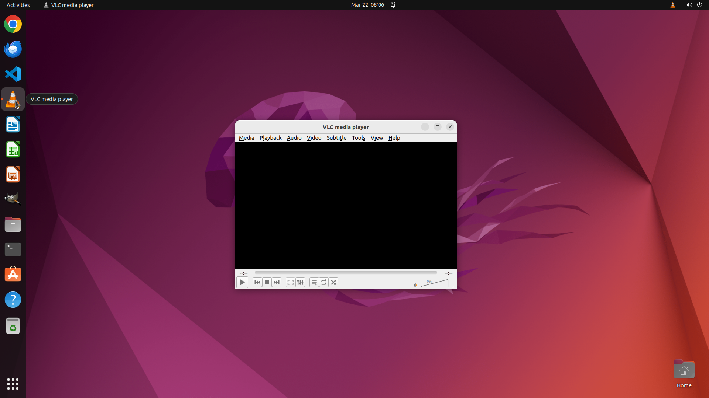

# Can you disable the cone icon in the splash screen? I am tired of its skeuomorphic design.

[← VLC](../README.md) · [← Showcase](../../README.md)

## Task

> Can you disable the cone icon in the splash screen? I am tired of its skeuomorphic design.

## Final state

## Artifacts

- [Trajectory](traj.jsonl) — per-step actions, reasoning, and screenshots
- [Runtime log](runtime.log)
- [Task definition](task.json) — original OSWorld task config
- Step screenshots: `step_*.png` in this folder

Task ID: `215dfd39-f493-4bc3-a027-8a97d72c61bf` · Domain: `vlc` · Source: `https://superuser.com/questions/1224784/how-to-change-vlcs-splash-screen`
