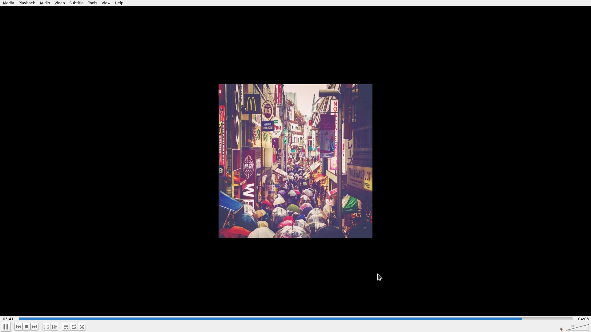

# I am reading lecture note in PDF while a music video is running in VLC media player. But I find I ne…

[← VLC](../README.md) · [← Showcase](../../README.md)

## Task

> I am reading lecture note in PDF while a music video is running in VLC media player. But I find I need to switch to the player every time I need to pause/start.Could you help me change the setting to allow pausing the video using keyboard shortcut without minimizing the PDF reader? I want to focus on the lecture note and don't be disturbed by the app switching.

## Final state

## Artifacts

- [Trajectory](traj.jsonl) — per-step actions, reasoning, and screenshots
- [Runtime log](runtime.log)
- [Task definition](task.json) — original OSWorld task config
- Step screenshots: `step_*.png` in this folder

Task ID: `386dbd0e-0241-4a0a-b6a2-6704fba26b1c` · Domain: `vlc` · Source: `https://superuser.com/questions/1708415/pause-and-play-vlc-in-background?rq=1`
