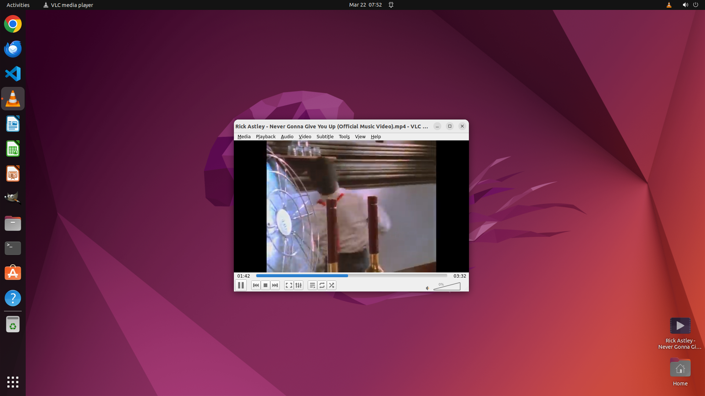

# Could you play the music video that's saved on my desktop for me via vlc?

[← VLC](../README.md) · [← Showcase](../../README.md)

## Task

> Could you play the music video that's saved on my desktop for me via vlc?

## Final state

## Artifacts

- [▶ Screen recording](recording.mp4) — full agent run
- [Trajectory](traj.jsonl) — per-step actions, reasoning, and screenshots
- [Runtime log](runtime.log)
- [Task definition](task.json) — original OSWorld task config
- Step screenshots: `step_*.png` in this folder

Task ID: `59f21cfb-0120-4326-b255-a5b827b38967` · Domain: `vlc` · Source: `https://docs.videolan.me/vlc-user/desktop/3.0/en/basic/media.html#playing-a-file`
