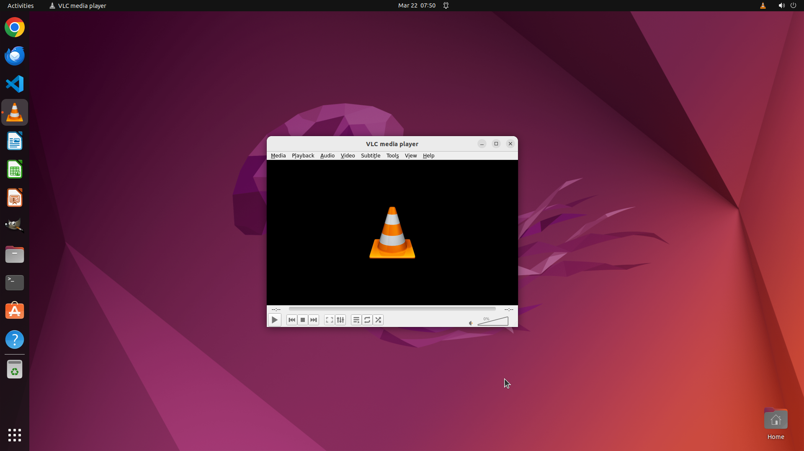

# My VLC Media Player has been auto-closing once the video ends. It is very annoying. Could you help m…

[← VLC](../README.md) · [← Showcase](../../README.md)

## Task

> My VLC Media Player has been auto-closing once the video ends. It is very annoying. Could you help me prevent the VLC Media Player from auto-closing once the video ends?

## Final state

## Artifacts

- [▶ Screen recording](recording.mp4) — full agent run
- [Trajectory](traj.jsonl) — per-step actions, reasoning, and screenshots
- [Runtime log](runtime.log)
- [Task definition](task.json) — original OSWorld task config
- Step screenshots: `step_*.png` in this folder

Task ID: `5ac2891a-eacd-4954-b339-98abba077adb` · Domain: `vlc` · Source: `https://superuser.com/questions/1412810/how-to-prevent-vlc-media-player-from-auto-closing-after-video-end#:%7E:text=Click%20on%20%22Media%22on%20the,VLC%20player%20after%20video%20ending`
