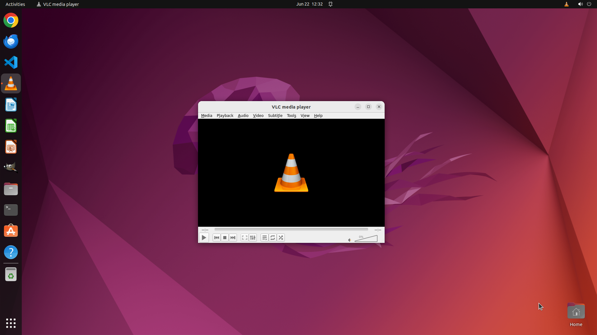

# Play the latest season of 'Stranger Things' purchased from the Google Play Movies & TV store directl…

[← VLC](../README.md) · [← Showcase](../../README.md)

## Task

> Play the latest season of 'Stranger Things' purchased from the Google Play Movies & TV store directly in VLC.

## Final state

## Artifacts

- [Trajectory](traj.jsonl) — per-step actions, reasoning, and screenshots
- [Runtime log](runtime.log)
- [Task definition](task.json) — original OSWorld task config
- Step screenshots: `step_*.png` in this folder

Task ID: `7882ed6e-bece-4bf0-bada-c32dc1ddae72` · Domain: `vlc` · Source: `https://wiki.videolan.org/Digital_Restrictions_Management/`
