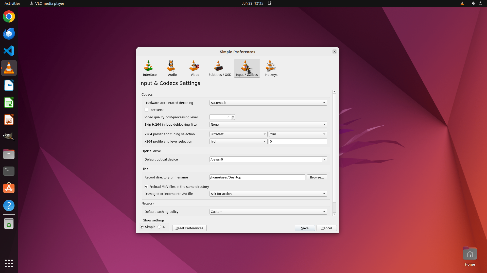

# Help me modify the folder used to store my recordings to Desktop

[← VLC](../README.md) · [← Showcase](../../README.md)

## Task

> Help me modify the folder used to store my recordings to Desktop

## Final state

## Artifacts

- [Trajectory](traj.jsonl) — per-step actions, reasoning, and screenshots
- [Runtime log](runtime.log)
- [Task definition](task.json) — original OSWorld task config
- Step screenshots: `step_*.png` in this folder

Task ID: `8ba5ae7a-5ae5-4eab-9fcc-5dd4fe3abf89` · Domain: `vlc` · Source: `https://docs.videolan.me/vlc-user/desktop/3.0/en/basic/recording/playing.html#choose-your-recordings-folder`
