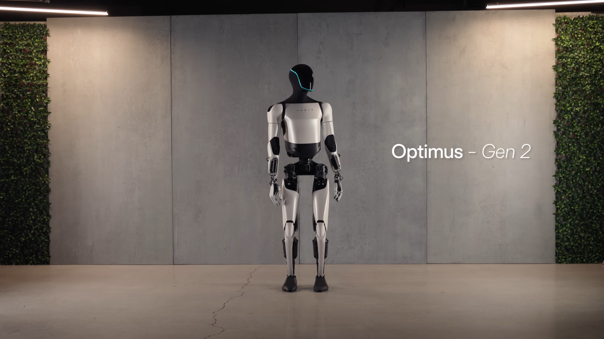

# Can you enable fullscreen mode in VLC so that the video fill up the whole screen?

[← VLC](../README.md) · [← Showcase](../../README.md)

## Task

> Can you enable fullscreen mode in VLC so that the video fill up the whole screen?

## Final state

## Artifacts

- [Trajectory](traj.jsonl) — per-step actions, reasoning, and screenshots
- [Runtime log](runtime.log)
- [Task definition](task.json) — original OSWorld task config
- Step screenshots: `step_*.png` in this folder

Task ID: `8d9fd4e2-6fdb-46b0-b9b9-02f06495c62f` · Domain: `vlc` · Source: `https://www.youtube.com/watch?v=XHprwDJ0-fU&t=436s`
