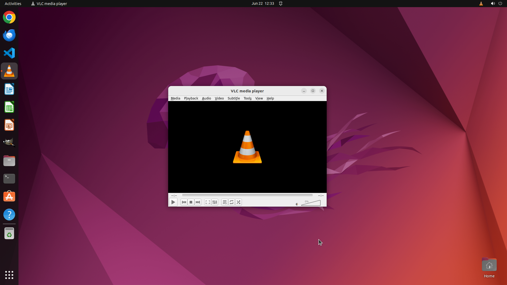

# I like watching movies (using VLC) on my laptop and sometimes the volume is too low for my taste eve…

[← VLC](../README.md) · [← Showcase](../../README.md)

## Task

> I like watching movies (using VLC) on my laptop and sometimes the volume is too low for my taste even when the volume in VLC is set to the maximum of 125% on the volume control. Can you increase the max volume of the video to the 200% of the original volume?

## Final state

## Artifacts

- [Trajectory](traj.jsonl) — per-step actions, reasoning, and screenshots
- [Runtime log](runtime.log)
- [Task definition](task.json) — original OSWorld task config
- Step screenshots: `step_*.png` in this folder

Task ID: `9195653c-f4aa-453d-aa95-787f6ccfaae9` · Domain: `vlc` · Source: `https://superuser.com/questions/1513285/how-can-i-increase-the-maximum-volume-output-by-vlc?rq=1`
