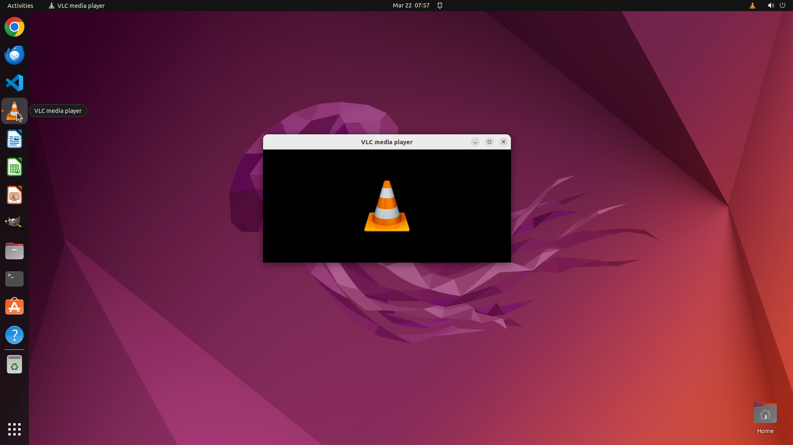

# Enable VLC Minimal Interface in window mode so the bottom playback controls are hidden, and make sur…

[← VLC](../README.md) · [← Showcase](../../README.md)

## Task

> Enable VLC Minimal Interface in window mode so the bottom playback controls are hidden, and make sure the setting persists after restarting VLC. I often multitask on my computer, and the persistent toolbar in VLC is very distracting.

## Final state

## Artifacts

- [▶ Screen recording](recording.mp4) — full agent run
- [Trajectory](traj.jsonl) — per-step actions, reasoning, and screenshots
- [Runtime log](runtime.log)
- [Task definition](task.json) — original OSWorld task config
- Step screenshots: `step_*.png` in this folder

Task ID: `a5bbbcd5-b398-4c91-83d4-55e1e31bbb81` · Domain: `vlc` · Source: `https://superuser.com/questions/776056/how-to-hide-bottom-toolbar-in-vlc`
