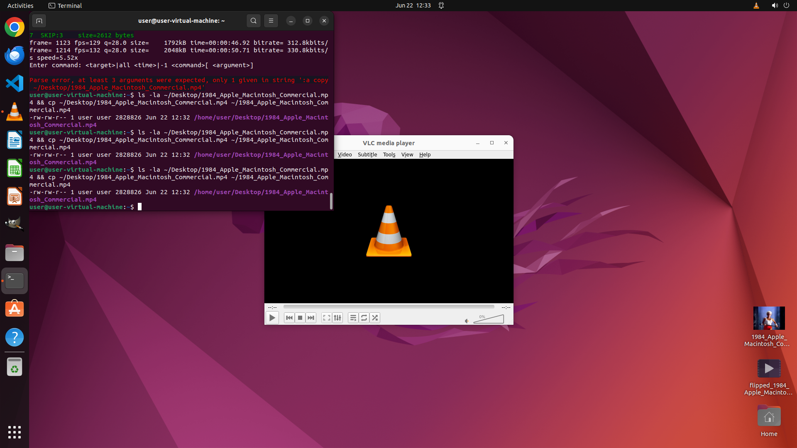

# Hey, could you turn this video the right way up for me? And once it's flipped around, could you save…

[← VLC](../README.md) · [← Showcase](../../README.md)

## Task

> Hey, could you turn this video the right way up for me? And once it's flipped around, could you save it for me with the name '1984_Apple_Macintosh_Commercial.mp4' on the main screen where all my files are?

## Final state

## Artifacts

- [Trajectory](traj.jsonl) — per-step actions, reasoning, and screenshots
- [Runtime log](runtime.log)
- [Task definition](task.json) — original OSWorld task config
- Step screenshots: `step_*.png` in this folder

Task ID: `aa4b5023-aef6-4ed9-bdc9-705f59ab9ad6` · Domain: `vlc` · Source: `https://www.dedoimedo.com/computers/vlc-rotate-videos.html`
