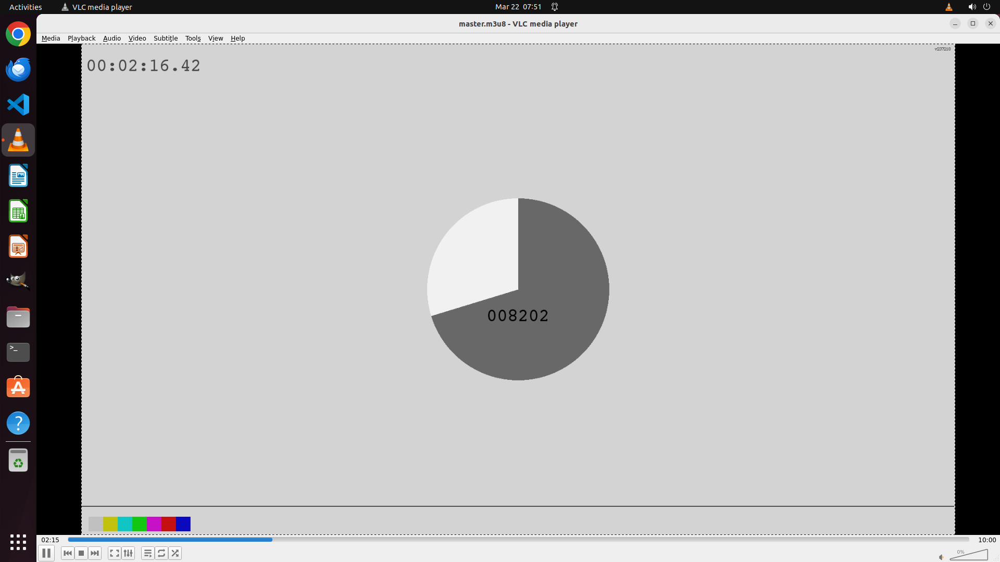

# Can you start streaming the video from this link for me? https://devstreaming-cdn.apple.com/videos/s…

[← VLC](../README.md) · [← Showcase](../../README.md)

## Task

> Can you start streaming the video from this link for me? https://devstreaming-cdn.apple.com/videos/streaming/examples/img_bipbop_adv_example_fmp4/master.m3u8

## Final state

## Artifacts

- [Trajectory](traj.jsonl) — per-step actions, reasoning, and screenshots
- [Runtime log](runtime.log)
- [Task definition](task.json) — original OSWorld task config
- Step screenshots: `step_*.png` in this folder

Task ID: `bba3381f-b5eb-4439-bd9e-80c22218d5a7` · Domain: `vlc` · Source: `https://developer.apple.com/streaming/examples/ - Apple HLS test streams for developers`
