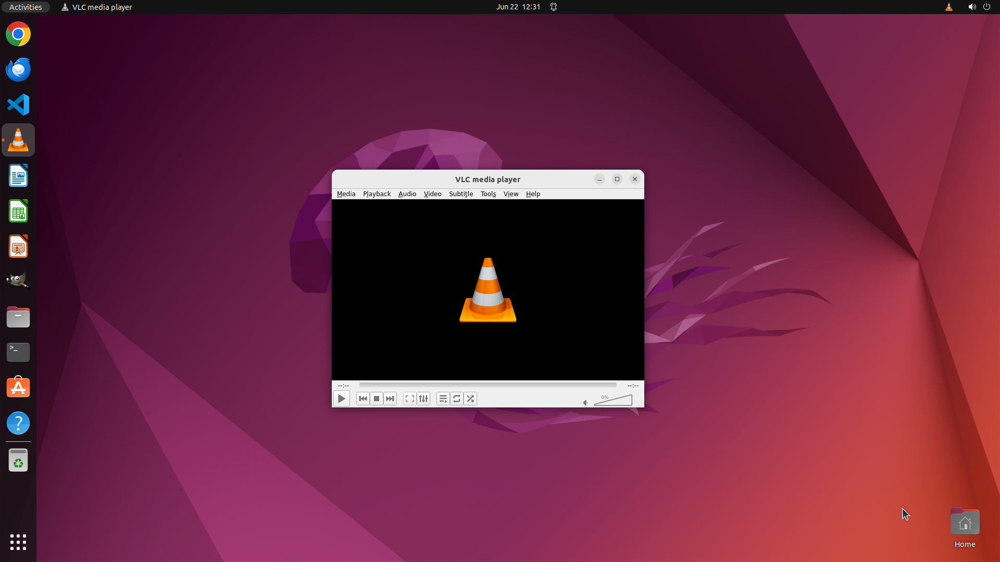

# Automatically adjust the brightness and contrast of this video to match my room's lighting.

[← VLC](../README.md) · [← Showcase](../../README.md)

## Task

> Automatically adjust the brightness and contrast of this video to match my room's lighting.

## Final state

## Artifacts

- [Trajectory](traj.jsonl) — per-step actions, reasoning, and screenshots
- [Runtime log](runtime.log)
- [Task definition](task.json) — original OSWorld task config
- Step screenshots: `step_*.png` in this folder

Task ID: `cb130f0d-d36f-4302-9838-b3baf46139b6` · Domain: `vlc` · Source: `https://www.vlchelp.com/increase-brightness-contrast-videos/`
