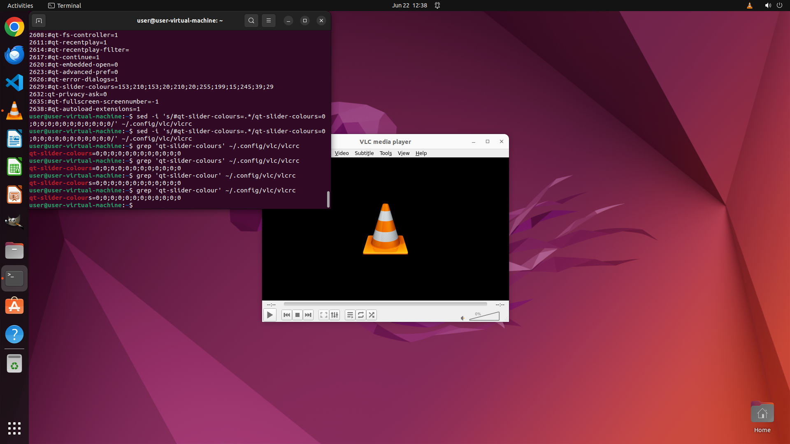

# Can you change the color of the volume slider to black-ish color? I often use the player in a low-li…

[← VLC](../README.md) · [← Showcase](../../README.md)

## Task

> Can you change the color of the volume slider to black-ish color? I often use the player in a low-light environment, and a darker color scheme would be less straining on my eyes, especially during nighttime usage.

## Final state

## Artifacts

- [Trajectory](traj.jsonl) — per-step actions, reasoning, and screenshots
- [Runtime log](runtime.log)
- [Task definition](task.json) — original OSWorld task config
- Step screenshots: `step_*.png` in this folder

Task ID: `d06f0d4d-2cd5-4ede-8de9-598629438c6e` · Domain: `vlc` · Source: `https://superuser.com/questions/1039392/changing-colour-of-vlc-volume-slider`
