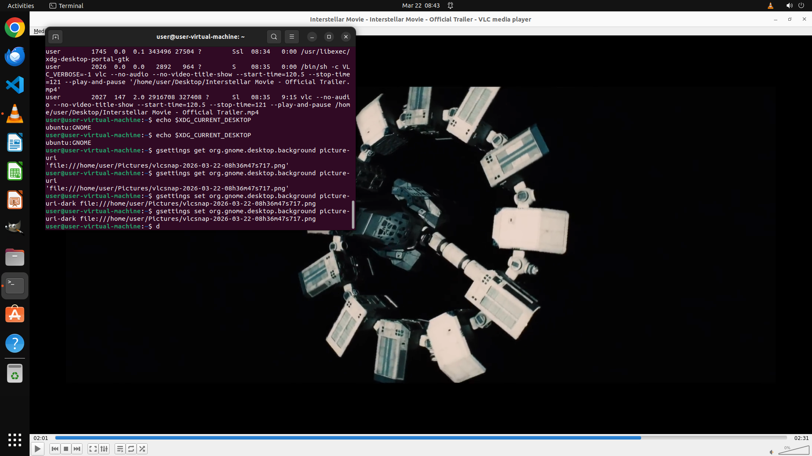

# Make this part of the video my computer's background picture

[← VLC](../README.md) · [← Showcase](../../README.md)

## Task

> Make this part of the video my computer's background picture

## Final state

## Artifacts

- [Trajectory](traj.jsonl) — per-step actions, reasoning, and screenshots
- [Runtime log](runtime.log)
- [Task definition](task.json) — original OSWorld task config
- Step screenshots: `step_*.png` in this folder

Task ID: `efcf0d81-0835-4880-b2fd-d866e8bc2294` · Domain: `vlc` · Source: `https://www.youtube.com/watch?v=XHprwDJ0-fU&t=436s, https://help.ubuntu.com/stable/ubuntu-help/look-background.html.en`
