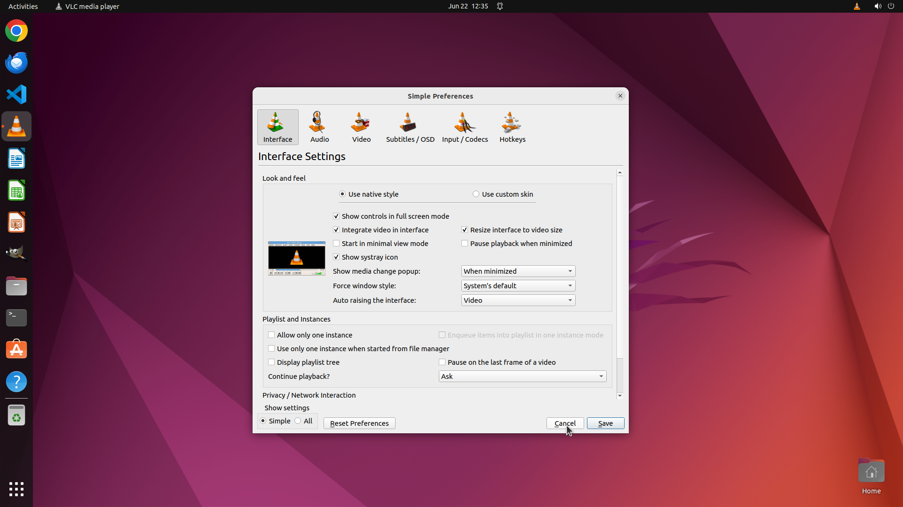

# I want to watch two or more videos in same time on VLC. I tried to run multiple instances of VLC. It…

[← VLC](../README.md) · [← Showcase](../../README.md)

## Task

> I want to watch two or more videos in same time on VLC. I tried to run multiple instances of VLC. It worked but can't play videos on those new instances. When I play video it plays on first instance instead of new instance.
Is there any way to solve this problem?

## Final state

## Artifacts

- [Trajectory](traj.jsonl) — per-step actions, reasoning, and screenshots
- [Runtime log](runtime.log)
- [Task definition](task.json) — original OSWorld task config
- Step screenshots: `step_*.png` in this folder

Task ID: `f3977615-2b45-4ac5-8bba-80c17dbe2a37` · Domain: `vlc` · Source: `https://www.reddit.com/r/Fedora/comments/rhljzd/how_to_run_multiple_instances_of_vlc_media_player/`
