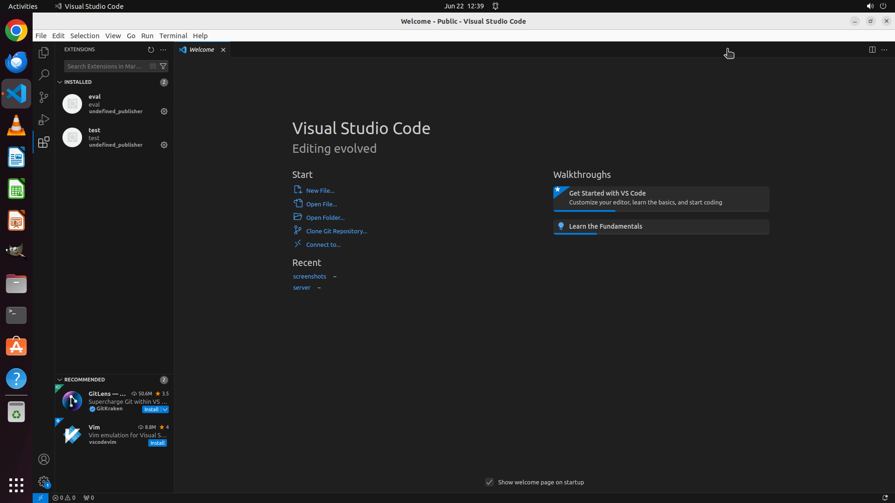

# Please help me install an extension in VS Code from a local VSIX file "/home/user/test.vsix".

[← VS Code](../README.md) · [← Showcase](../../README.md)

## Task

> Please help me install an extension in VS Code from a local VSIX file "/home/user/test.vsix".

## Final state

## Artifacts

- [Trajectory](traj.jsonl) — per-step actions, reasoning, and screenshots
- [Runtime log](runtime.log)
- [Task definition](task.json) — original OSWorld task config
- Step screenshots: `step_*.png` in this folder

Task ID: `0512bb38-d531-4acf-9e7e-0add90816068` · Domain: `vs_code` · Source: `https://download.microsoft.com/download/8/A/4/8A48E46A-C355-4E5C-8417-E6ACD8A207D4/VisualStudioCode-TipsAndTricks-Vol.1.pdf`
