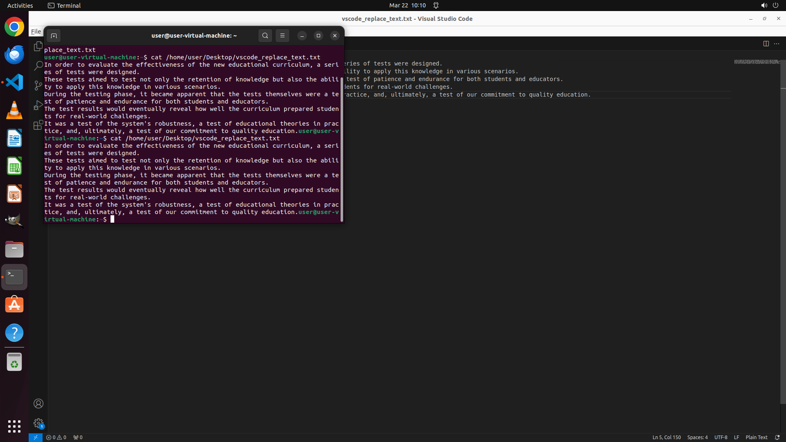

# Please help me change all the places in this document that say "text" to "test".

[← VS Code](../README.md) · [← Showcase](../../README.md)

## Task

> Please help me change all the places in this document that say "text" to "test".

## Final state

## Artifacts

- [▶ Screen recording](recording.mp4) — full agent run
- [Trajectory](traj.jsonl) — per-step actions, reasoning, and screenshots
- [Runtime log](runtime.log)
- [Task definition](task.json) — original OSWorld task config
- Step screenshots: `step_*.png` in this folder

Task ID: `0ed39f63-6049-43d4-ba4d-5fa2fe04a951` · Domain: `vs_code` · Source: `https://www.quora.com/How-do-you-find-and-replace-text-in-Visual-Studio-Code`
