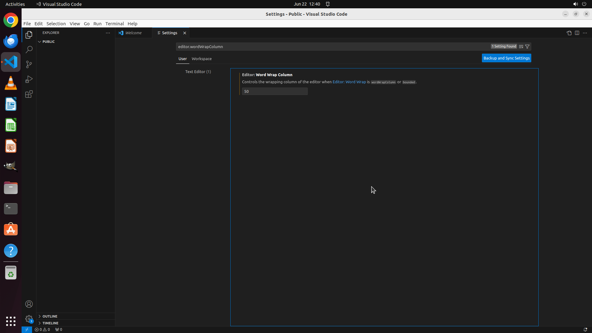

# Please help me set the current user's line length for code wrapping to 50 characters in VS Code.

[← VS Code](../README.md) · [← Showcase](../../README.md)

## Task

> Please help me set the current user's line length for code wrapping to 50 characters in VS Code.

## Final state

## Artifacts

- [Trajectory](traj.jsonl) — per-step actions, reasoning, and screenshots
- [Runtime log](runtime.log)
- [Task definition](task.json) — original OSWorld task config
- Step screenshots: `step_*.png` in this folder

Task ID: `276cc624-87ea-4f08-ab93-f770e3790175` · Domain: `vs_code` · Source: `https://www.quora.com/unanswered/How-do-you-set-the-line-length-in-Visual-Studio-Code`
