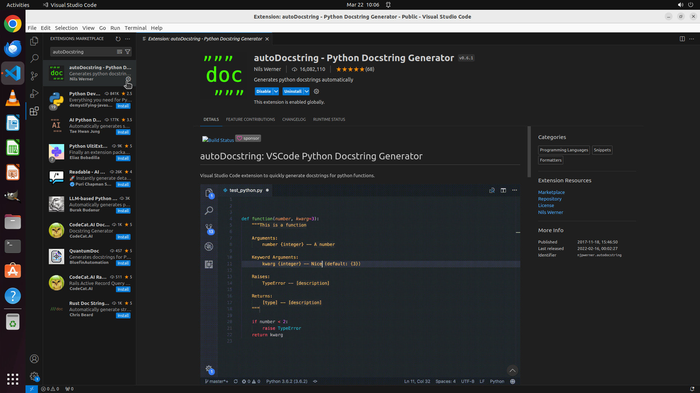

# Please help me install the autoDocstring extension in VS Code.

[← VS Code](../README.md) · [← Showcase](../../README.md)

## Task

> Please help me install the autoDocstring extension in VS Code.

## Final state

## Artifacts

- [▶ Screen recording](recording.mp4) — full agent run
- [Trajectory](traj.jsonl) — per-step actions, reasoning, and screenshots
- [Runtime log](runtime.log)
- [Task definition](task.json) — original OSWorld task config
- Step screenshots: `step_*.png` in this folder

Task ID: `4e60007a-f5be-4bfc-9723-c39affa0a6d3` · Domain: `vs_code` · Source: `https://campbell-muscle-lab.github.io/howtos_Python/pages/documentation/best_practices/vscode_docstring_extension/vscode_docstring_extension.html#:~:text=Type%2C%20Ctrl%20%2B%20Shift%20%2B%20P,select%20the%20NumPy%20docstring%20format.`
