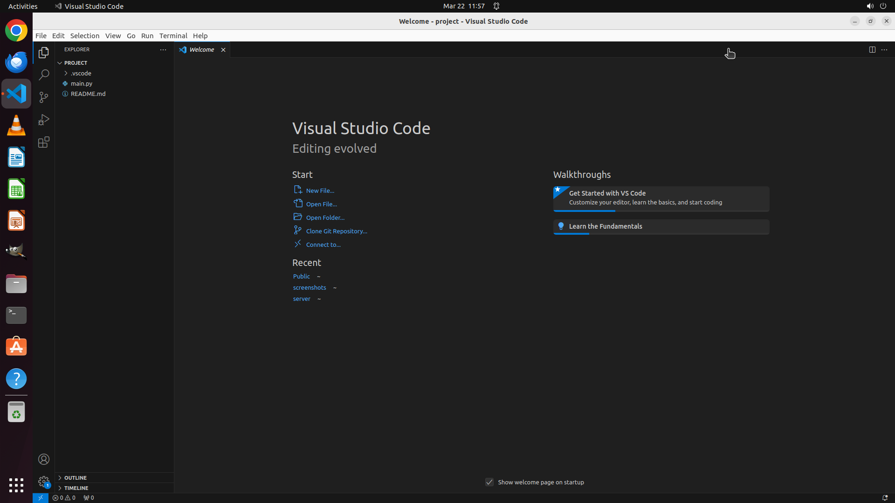

# Please help me use VS Code to open the "project" in the "user" folder under "home".

[← VS Code](../README.md) · [← Showcase](../../README.md)

## Task

> Please help me use VS Code to open the "project" in the "user" folder under "home".

## Final state

## Artifacts

- [▶ Screen recording](recording.mp4) — full agent run
- [Trajectory](traj.jsonl) — per-step actions, reasoning, and screenshots
- [Runtime log](runtime.log)
- [Task definition](task.json) — original OSWorld task config
- Step screenshots: `step_*.png` in this folder

Task ID: `53ad5833-3455-407b-bbc6-45b4c79ab8fb` · Domain: `vs_code` · Source: `https://www.youtube.com/watch?v=VqCgcpAypFQ`
