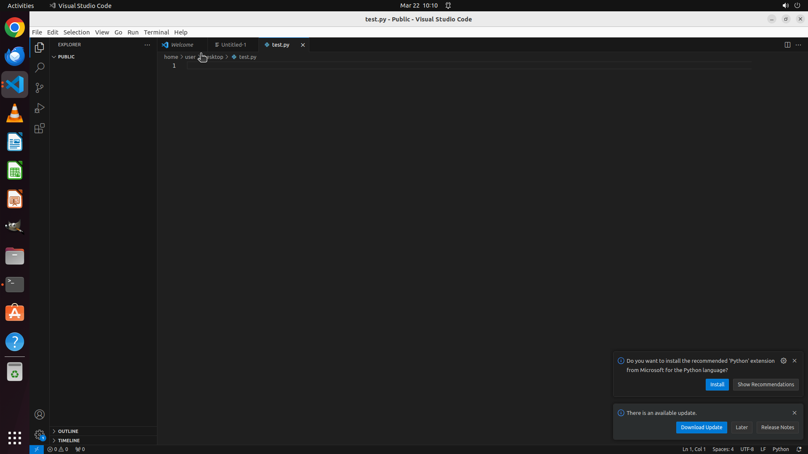

# Please help me create a new python file named "test.py" via VS Code and save it at "/home/user/Deskt…

[← VS Code](../README.md) · [← Showcase](../../README.md)

## Task

> Please help me create a new python file named "test.py" via VS Code and save it at "/home/user/Desktop".

## Final state

## Artifacts

- [▶ Screen recording](recording.mp4) — full agent run
- [Trajectory](traj.jsonl) — per-step actions, reasoning, and screenshots
- [Runtime log](runtime.log)
- [Task definition](task.json) — original OSWorld task config
- Step screenshots: `step_*.png` in this folder

Task ID: `57242fad-77ca-454f-b71b-f187181a9f23` · Domain: `vs_code` · Source: `https://download.microsoft.com/download/8/A/4/8A48E46A-C355-4E5C-8417-E6ACD8A207D4/VisualStudioCode-TipsAndTricks-Vol.1.pdf`
