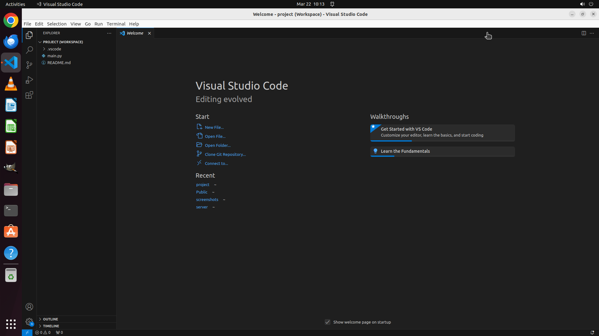

# Please help me save current project as workspace "project" at "/home/user/".

[← VS Code](../README.md) · [← Showcase](../../README.md)

## Task

> Please help me save current project as workspace "project" at "/home/user/".

## Final state

## Artifacts

- [Trajectory](traj.jsonl) — per-step actions, reasoning, and screenshots
- [Runtime log](runtime.log)
- [Task definition](task.json) — original OSWorld task config
- Step screenshots: `step_*.png` in this folder

Task ID: `5e2d93d8-8ad0-4435-b150-1692aacaa994` · Domain: `vs_code` · Source: `https://www.youtube.com/watch?v=B-s71n0dHUk`
