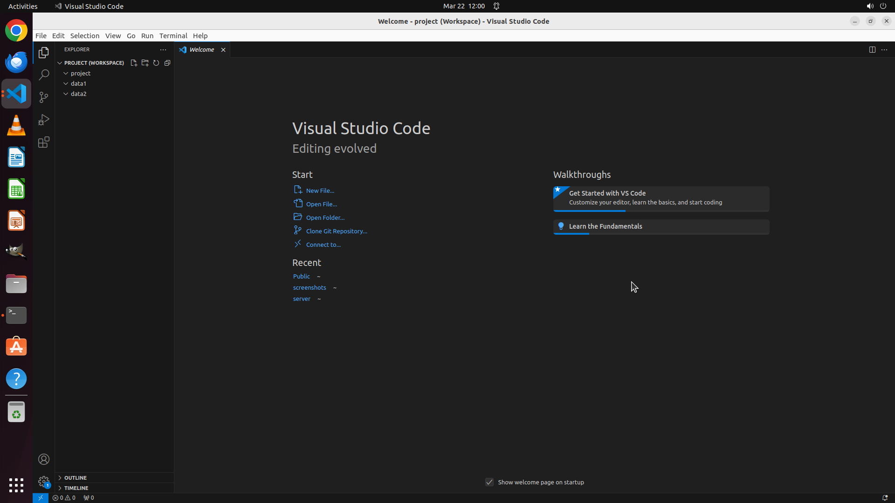

# Please help me add folder "/home/user/data1" and folder "/home/user/data2" to the current workspace.

[← VS Code](../README.md) · [← Showcase](../../README.md)

## Task

> Please help me add folder "/home/user/data1" and folder "/home/user/data2" to the current workspace.

## Final state

## Artifacts

- [▶ Screen recording](recording.mp4) — full agent run
- [Trajectory](traj.jsonl) — per-step actions, reasoning, and screenshots
- [Runtime log](runtime.log)
- [Task definition](task.json) — original OSWorld task config
- Step screenshots: `step_*.png` in this folder

Task ID: `6ed0a554-cbee-4b44-84ea-fd6c042f4fe1` · Domain: `vs_code` · Source: `https://www.youtube.com/watch?v=B-s71n0dHUk`
