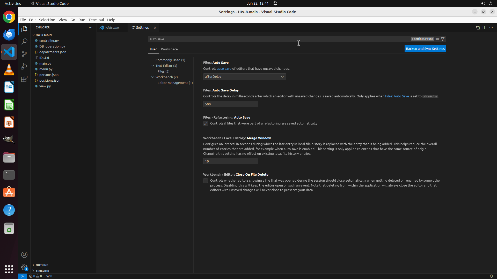

# Please help me open the autosave feature of VS Code and delay AutoSave operations for 500 millisecon…

[← VS Code](../README.md) · [← Showcase](../../README.md)

## Task

> Please help me open the autosave feature of VS Code and delay AutoSave operations for 500 milliseconds in the VS Code setting.

## Final state

## Artifacts

- [Trajectory](traj.jsonl) — per-step actions, reasoning, and screenshots
- [Runtime log](runtime.log)
- [Task definition](task.json) — original OSWorld task config
- Step screenshots: `step_*.png` in this folder

Task ID: `70745df8-f2f5-42bd-8074-fbc10334fcc5` · Domain: `vs_code` · Source: `https://download.microsoft.com/download/8/A/4/8A48E46A-C355-4E5C-8417-E6ACD8A207D4/VisualStudioCode-TipsAndTricks-Vol.1.pdf`
