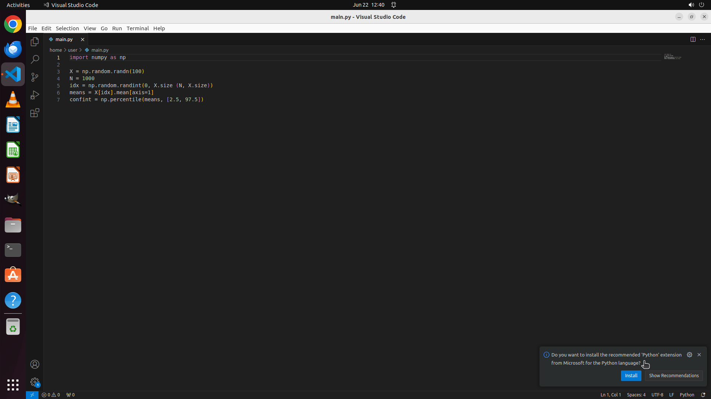

# Please help me visualize all numpy arrays in current python file within VS Code.

[← VS Code](../README.md) · [← Showcase](../../README.md)

## Task

> Please help me visualize all numpy arrays in current python file within VS Code.

## Final state

## Artifacts

- [Trajectory](traj.jsonl) — per-step actions, reasoning, and screenshots
- [Runtime log](runtime.log)
- [Task definition](task.json) — original OSWorld task config
- Step screenshots: `step_*.png` in this folder

Task ID: `7aeae0e2-70ee-4705-821d-1bba5d5b2ddd` · Domain: `vs_code`
