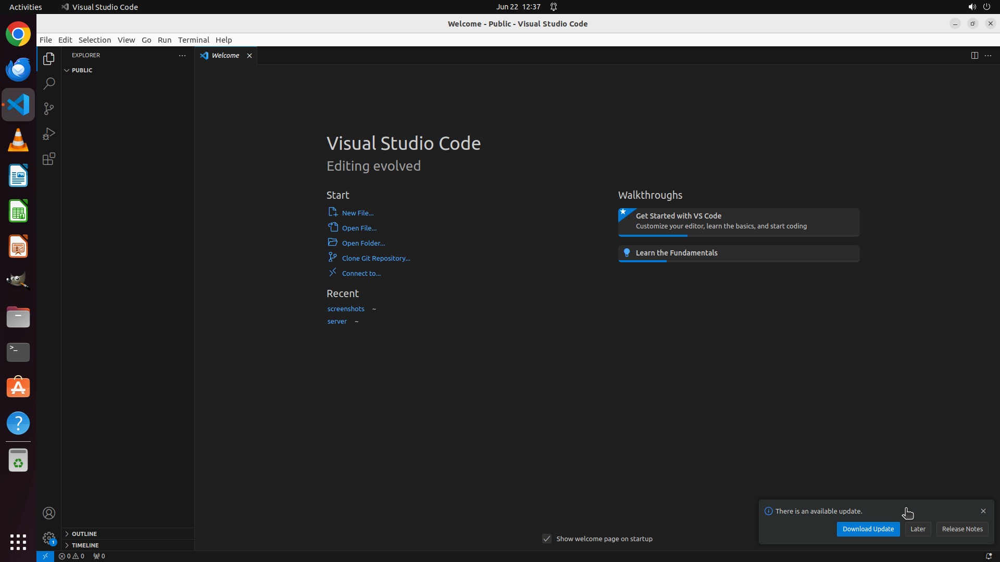

# Please help me open two workspaces "/home/user/workspace1.code-workspace" and "/home/user/workspace2…

[← VS Code](../README.md) · [← Showcase](../../README.md)

## Task

> Please help me open two workspaces "/home/user/workspace1.code-workspace" and "/home/user/workspace2.code-workspace" simultaneously in the same window.

## Final state

## Artifacts

- [Trajectory](traj.jsonl) — per-step actions, reasoning, and screenshots
- [Runtime log](runtime.log)
- [Task definition](task.json) — original OSWorld task config
- Step screenshots: `step_*.png` in this folder

Task ID: `847a96b6-df94-4927-97e6-8cc9ea66ced7` · Domain: `vs_code`
