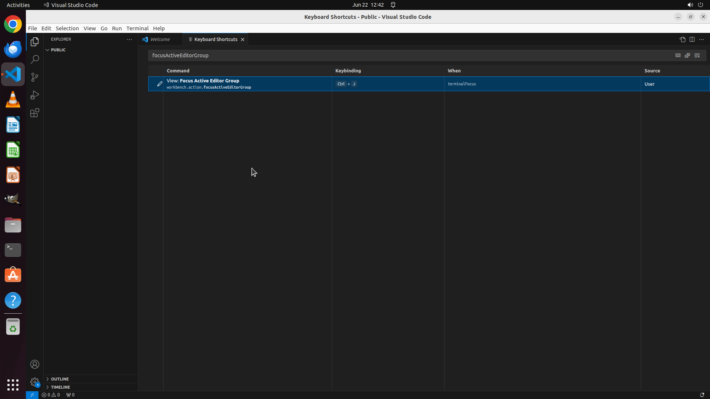

# Please help me create a shortcut "ctrl+j" to move cursor focus from terminal to editor in VS Code.

[← VS Code](../README.md) · [← Showcase](../../README.md)

## Task

> Please help me create a shortcut "ctrl+j" to move cursor focus from terminal to editor in VS Code.

## Final state

## Artifacts

- [Trajectory](traj.jsonl) — per-step actions, reasoning, and screenshots
- [Runtime log](runtime.log)
- [Task definition](task.json) — original OSWorld task config
- Step screenshots: `step_*.png` in this folder

Task ID: `930fdb3b-11a8-46fe-9bac-577332e2640e` · Domain: `vs_code` · Source: `https://superuser.com/questions/1270103/how-to-switch-the-cursor-between-terminal-and-code-in-vscode`
