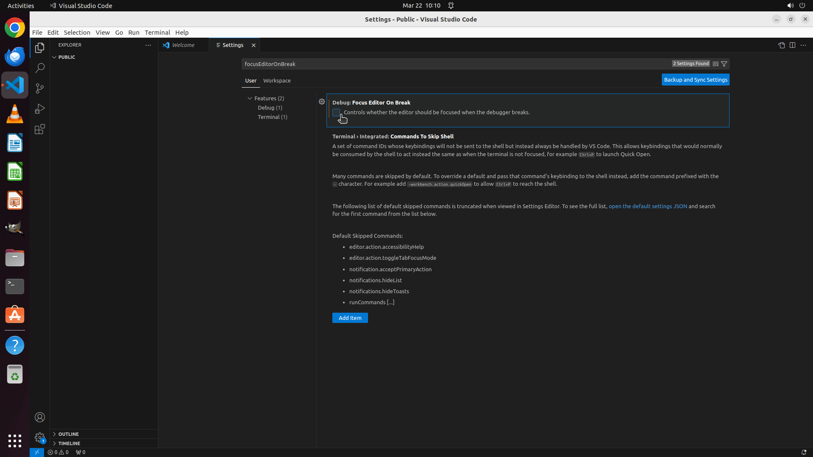

# Please help me modify the setting of VS Code to keep my cursor focused on the debug console when deb…

[← VS Code](../README.md) · [← Showcase](../../README.md)

## Task

> Please help me modify the setting of VS Code to keep my cursor focused on the debug console when debugging in VS Code, instead of automatically focusing back on the Editor.

## Final state

## Artifacts

- [▶ Screen recording](recording.mp4) — full agent run
- [Trajectory](traj.jsonl) — per-step actions, reasoning, and screenshots
- [Runtime log](runtime.log)
- [Task definition](task.json) — original OSWorld task config
- Step screenshots: `step_*.png` in this folder

Task ID: `9439a27b-18ae-42d8-9778-5f68f891805e` · Domain: `vs_code` · Source: `https://stackoverflow.com/questions/75832474/how-to-keep-cursor-in-debug-console-when-debugging-in-visual-studio-code`
