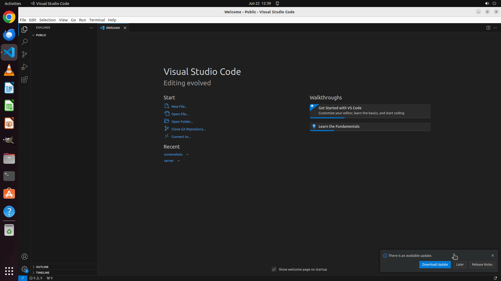

# Please help me change the settings of VS Code so that every time I open it, it automatically creates…

[← VS Code](../README.md) · [← Showcase](../../README.md)

## Task

> Please help me change the settings of VS Code so that every time I open it, it automatically creates a python file called "test.py" without using any extensions.

## Final state

## Artifacts

- [Trajectory](traj.jsonl) — per-step actions, reasoning, and screenshots
- [Runtime log](runtime.log)
- [Task definition](task.json) — original OSWorld task config
- Step screenshots: `step_*.png` in this folder

Task ID: `971cbb5b-3cbf-4ff7-9e24-b5c84fcebfa6` · Domain: `vs_code`
