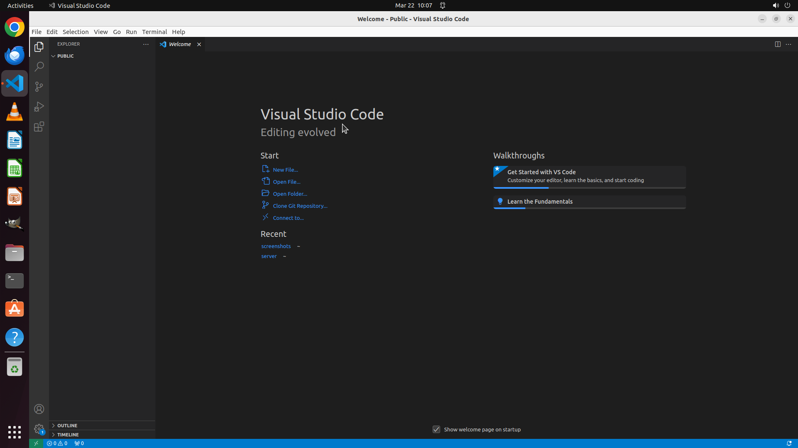

# Please help me change the color theme of VS Code to Visual Studio Dark.

[← VS Code](../README.md) · [← Showcase](../../README.md)

## Task

> Please help me change the color theme of VS Code to Visual Studio Dark.

## Final state

## Artifacts

- [▶ Screen recording](recording.mp4) — full agent run
- [Trajectory](traj.jsonl) — per-step actions, reasoning, and screenshots
- [Runtime log](runtime.log)
- [Task definition](task.json) — original OSWorld task config
- Step screenshots: `step_*.png` in this folder

Task ID: `982d12a5-beab-424f-8d38-d2a48429e511` · Domain: `vs_code` · Source: `https://www.youtube.com/watch?v=ORrELERGIHs`
