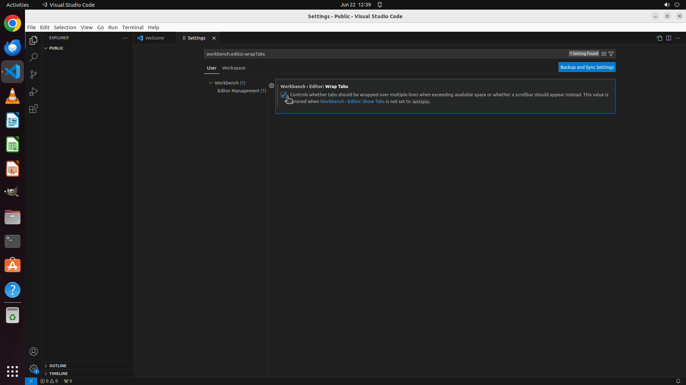

# I want to make the tabs wrapped over multiple lines when exceeding available space, please help modi…

[← VS Code](../README.md) · [← Showcase](../../README.md)

## Task

> I want to make the tabs wrapped over multiple lines when exceeding available space, please help modify the setting of VS Code.

## Final state

## Artifacts

- [Trajectory](traj.jsonl) — per-step actions, reasoning, and screenshots
- [Runtime log](runtime.log)
- [Task definition](task.json) — original OSWorld task config
- Step screenshots: `step_*.png` in this folder

Task ID: `9d425400-e9b2-4424-9a4b-d4c7abac4140` · Domain: `vs_code` · Source: `https://superuser.com/questions/1466771/is-there-a-way-to-make-editor-tabs-stack-in-vs-code`
