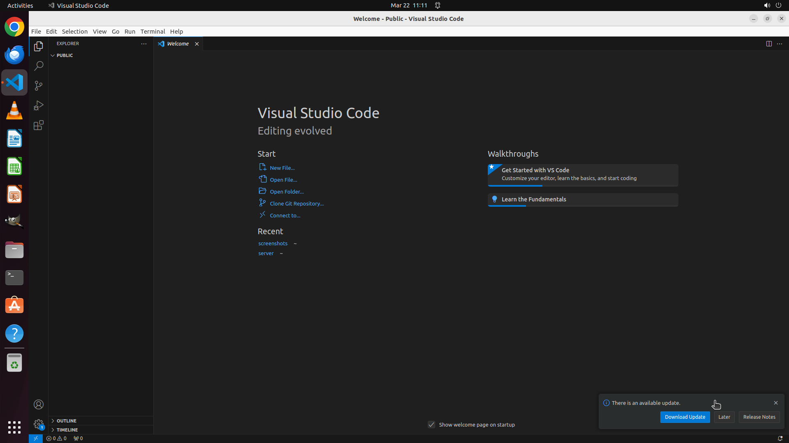

# Please help me change the background of VS Code to the photo in Downloads.

[← VS Code](../README.md) · [← Showcase](../../README.md)

## Task

> Please help me change the background of VS Code to the photo in Downloads.

## Final state

## Artifacts

- [▶ Screen recording](recording.mp4) — full agent run
- [Trajectory](traj.jsonl) — per-step actions, reasoning, and screenshots
- [Runtime log](runtime.log)
- [Task definition](task.json) — original OSWorld task config
- Step screenshots: `step_*.png` in this folder

Task ID: `dcbe20e8-647f-4f1d-8696-f1c5bbb570e3` · Domain: `vs_code`
