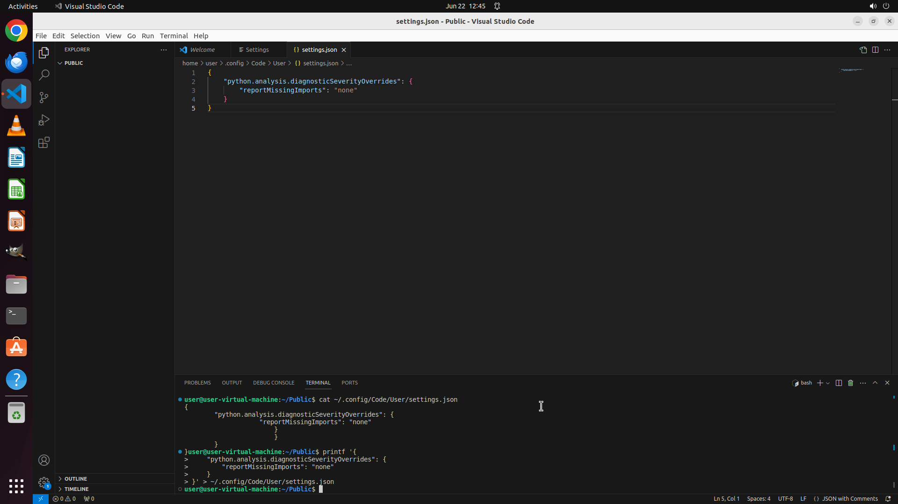

# Please modify VS Code's settings to disable error reporting for Python missing imports.

[← VS Code](../README.md) · [← Showcase](../../README.md)

## Task

> Please modify VS Code's settings to disable error reporting for Python missing imports.

## Final state

## Artifacts

- [Trajectory](traj.jsonl) — per-step actions, reasoning, and screenshots
- [Runtime log](runtime.log)
- [Task definition](task.json) — original OSWorld task config
- Step screenshots: `step_*.png` in this folder

Task ID: `e2b5e914-ffe1-44d2-8e92-58f8c5d92bb2` · Domain: `vs_code` · Source: `https://superuser.com/questions/1386061/how-to-suppress-some-python-errors-warnings-in-vs-code`
