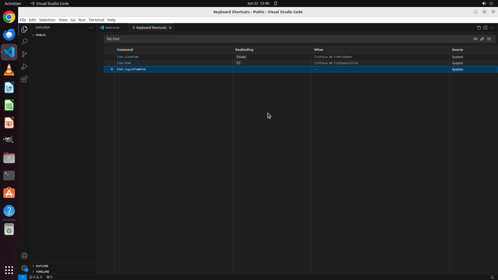

# Please help me remove the shortcut "ctrl+f" for Tree view Find (Explorer search) in VS Code Explorer…

[← VS Code](../README.md) · [← Showcase](../../README.md)

## Task

> Please help me remove the shortcut "ctrl+f" for Tree view Find (Explorer search) in VS Code Explorer view to avoid shortcut conflict.

## Final state

## Artifacts

- [Trajectory](traj.jsonl) — per-step actions, reasoning, and screenshots
- [Runtime log](runtime.log)
- [Task definition](task.json) — original OSWorld task config
- Step screenshots: `step_*.png` in this folder

Task ID: `ea98c5d7-3cf9-4f9b-8ad3-366b58e0fcae` · Domain: `vs_code` · Source: `['https://superuser.com/questions/1748097/vs-code-disable-tree-view-find-explorer-search', 'https://superuser.com/questions/1417361/how-to-disable-file-filtering-in-vs-code-sidebar-explorer?rq=1']`
