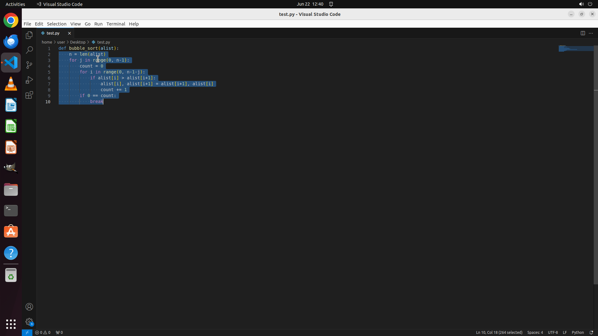

# Please help me increase the indent of line 2 to line 10 by one tab.

[← VS Code](../README.md) · [← Showcase](../../README.md)

## Task

> Please help me increase the indent of line 2 to line 10 by one tab.

## Final state

## Artifacts

- [Trajectory](traj.jsonl) — per-step actions, reasoning, and screenshots
- [Runtime log](runtime.log)
- [Task definition](task.json) — original OSWorld task config
- Step screenshots: `step_*.png` in this folder

Task ID: `ec71221e-ac43-46f9-89b8-ee7d80f7e1c5` · Domain: `vs_code` · Source: `https://stackoverflow.com/questions/47903209/how-to-shift-a-block-of-code-left-right-by-one-space-in-vscode`
